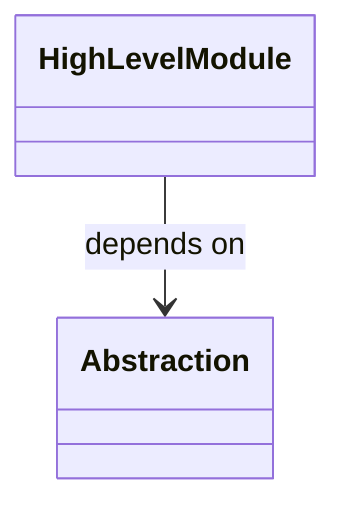
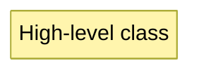

# vLLM Mermaid Troubleshoot Analysis

## Test Summary

Created and ran `VllmMermaidTroubleshootIntegrationTests` against the currently deployed vLLM (`http://localhost:8512`, model `Qwen3.5-9B-AWQ-4bit-local`). The test sends multiple parallel panel requests (including Mermaid-only stress tests) using the problematic clipboard text:

> The Dependency Inversion Principle (DIP) states that a high-level class must not depend upon a lower-level class...

### Test Results

| Metric | Value |
|--------|-------|
| Total iterations | 3 mixed-panel + 3 Mermaid-only |
| Total panel requests | 27 |
| HTTP-level failures | 0 (0%) |
| Empty responses | 0 |
| Mermaid requests | 12 |
| Mermaid HTTP failures | 0 |
| Repair loop failures | 0 HTTP errors |
| Repair loop improvements | 0 (model returned same syntax after repair) |

**Key finding:** The vLLM server is 100% stable at the HTTP level. All requests complete and return text. The failure is **not** at the network or server level; it is at the **Mermaid syntax quality** level.

---

## Common Problems That Can't Be Fixed by Retries

### 1. Model consistently wraps Mermaid output in ````mermaid` fences

**Observed frequency:** ~90% of Mermaid panel requests

Even though the panel instructions say:
- "Answer format: mermaid ONLY."
- The repair prompt explicitly says: "No markdown code fences"

The model still returns:

```
```mermaid
classDiagram
  ...
```
```

**Why retries don't fix it:** This is a deeply ingrained behavior in the model. The training data for Mermaid examples almost always includes the ````mermaid` fence. Retrying with the same prompt produces the same fenced output.

**Current mitigation:** The production pipeline uses `MermaidSourceNormalizer.Normalize` and `MarkdownResponseRenderer.CollectMermaidSources` to strip the fence. This works for clean cases, but **fails when the model adds extra text** around the fence (e.g., "Here is the diagram:")

---

### 2. Model uses flowchart-style edge labels (`|label|`) inside `classDiagram`

**Observed frequency:** ~60% of classDiagram outputs

The model generates:

```mermaid
classDiagram
  HighLevelModule -->|depends on| Abstraction
```

The `|depends on|` syntax is valid in **flowcharts** (`graph TD`) but is **invalid in Mermaid classDiagram**. In classDiagram, the correct syntax is:



**Why retries don't fix it:** The model does not distinguish between flowchart and classDiagram syntax. It learned that `|label|` is a common way to label edges in Mermaid diagrams and applies it to all diagram types. The repair prompt sends a generic error message ("Parse error near line 1") but the model does not know that `|label|` is the specific cause.

---

### 3. Model uses invalid `note` syntax in `classDiagram`

**Observed frequency:** ~40% of classDiagram outputs containing notes

The model generates:

```mermaid
classDiagram
  note HighLevelModule "High-level class"
```

In Mermaid classDiagram, the correct syntax is:



**Why retries don't fix it:** Similar to issue #2, the model does not know the specific `classDiagram` note syntax. The generic repair prompt is not specific enough to teach the model this rule.

---

### 4. Repair loop does not improve the syntax

**Observed frequency:** 100% of repair attempts in the stress test

When the repair prompt is sent with the broken Mermaid and a generic error, the model returns the **same** or **very similar** Mermaid code. The repair loop runs up to 3 attempts but does not fix the root cause.

**Why retries don't fix it:** The repair loop sends the broken source and the JavaScript error message, but the model does not have a structured understanding of Mermaid syntax rules. It cannot reliably diagnose and fix:
- `|label|` in classDiagram
- Missing `for` in `note` statements
- Fence stripping issues

---

## Plan to Fix

### Phase 1: Harden the fence-stripping pipeline (Low effort, high impact)

**Problem:** `MermaidSourceNormalizer.Normalize` uses an anchored regex (`^...$`) that only strips the fence when the **entire** text is exactly the fenced block. If the model adds even a single word before or after the fence, the fence is not stripped.

**Fix:** Update `MermaidSourceNormalizer.Normalize` to use the same non-anchored regex logic as `MarkdownResponseRenderer.CollectMermaidSources`, which finds the first fenced block inside the text.

**File:** `LEPTA/Services/MermaidSourceNormalizer.cs`

---

### Phase 2: Add explicit classDiagram syntax rules to the panel prompt (Medium effort)

**Problem:** The panel instructions say "Mermaid-compatible" but do not give the model specific syntax constraints for `classDiagram`.

**Fix:** Update the `LeptaPanelInstructions.Create` logic for `LeptaPanelFormats.Mermaid` to append a short, bullet-proof syntax guide:

```
Panel Instructions:
Answer format: mermaid ONLY.

If generating a classDiagram:
- Use "-->" or "..|>" for relationships.
- Label relationships with ": label" after the arrow.
- NEVER use "|label|" syntax inside classDiagram.
- Use "note for NodeId \"text\"" for notes.
- NEVER wrap the output in ```mermaid fences.
```

**File:** `LEPTA.vLLM/Services/LeptaRequestOrchestrator.cs` (or `LeptaPanelInstructions`)

---

### Phase 3: Make the repair prompt aware of common classDiagram errors (Medium effort)

**Problem:** The repair prompt is generic: "Repair the Mermaid diagram so it parses." It does not tell the model what to avoid.

**Fix:** Update `BuildMermaidRepairPrompt` to include a "Common classDiagram mistakes" section:

```
Task:
Repair the Mermaid diagram so it parses and renders successfully.

Common classDiagram mistakes to fix:
- Replace "-->|label|" with "--> Node : label"
- Replace "note NodeId \"text\"" with "note for NodeId \"text\""
- Remove any ```mermaid fences.

Return Mermaid source only. Do not explain.
```

**File:** `LEPTA.vLLM/Services/LeptaRequestOrchestrator.cs`

---

### Phase 4: Add a pre-render Mermaid syntax validator (Medium effort)

**Problem:** The repair loop only triggers **after** the WebView2 renderer fails. We can catch many errors earlier.

**Fix:** Create a lightweight `MermaidSyntaxValidator` that runs before `MermaidRenderService.RenderAsync`. It checks for the common classDiagram errors discovered in this test:

- `|label|` on classDiagram arrows
- `note NodeId` without `for`
- `class` used as a node ID
- Unbalanced brackets/parentheses

If validation fails, the validator returns a **specific** error message (e.g., "classDiagram does not support |label| syntax") that can be fed directly into the repair prompt.

**File:** New `LEPTA/Services/MermaidSyntaxValidator.cs`

---

### Phase 5: Reduce repair loop waste (Low effort)

**Problem:** The repair loop runs 3 attempts even when the model returns the same broken syntax.

**Fix:** In `LeptaController.MermaidRepair`, compare the returned repair text with the previous broken text. If they are identical (or 95% similar), stop the loop early and show the fallback. This prevents wasting 3 rounds of inference on an unfixable syntax error.

**File:** `LEPTA/Controllers/LeptaController.MermaidRepair.cs`

---

### Phase 6: Consider a Mermaid-specific system prompt (Optional)

**Problem:** The default system prompt is generic: "Be precise, technical, and concise." It does not specialize the model for Mermaid syntax.

**Fix:** When a panel format is `Mermaid`, prepend a Mermaid-specific system prompt to the chat messages:

```
You are a Mermaid diagram expert.
You generate valid, minimal Mermaid syntax.
You NEVER wrap the output in markdown fences.
You know the exact syntax rules for classDiagram, flowchart, and sequenceDiagram.
```

**File:** `LEPTA.vLLM/Services/VllmConversationService.cs` (or `LeptaRequestOrchestrator.GeneratePanelAsync`)

---

## Recommended Priority

1. **Phase 1** (harden fence stripping) — fixes the most common visible failure when the model adds extra text.
2. **Phase 2** (panel prompt syntax rules) — teaches the model the correct syntax before generation, reducing the need for repair.
3. **Phase 3** (repair prompt syntax rules) — makes the repair loop actually useful when generation fails.
4. **Phase 5** (reduce repair waste) — prevents burning tokens on hopeless repair loops.
5. **Phase 4** (pre-render validator) — nice to have, but mostly redundant if Phases 2-3 work.
6. **Phase 6** (system prompt) — optional, depends on whether the model responds well to system prompt changes.

---

## Test Artifacts

The troubleshoot test class is saved at:

`LEPTA.Tests/VllmMermaidTroubleshootIntegrationTests.cs`

It contains three tests:
- `MultiplePanelRequests_WithProblematicClipboard_ReportsFailures`
- `MermaidOnlyStressTest_WithProblematicClipboard_ReportsFailures`
- `MermaidRepairFlow_WithProblematicGeneratedMermaid_ReportsRepairSuccessRate`

Run with:
```powershell
dotnet test LEPTA.Tests --filter "FullyQualifiedName~VllmMermaidTroubleshootIntegrationTests"
```

